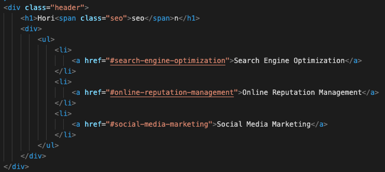
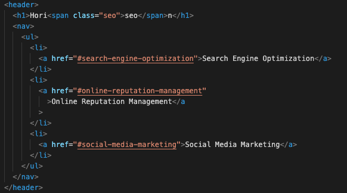

# Module 1 Challenge - Code Refactor

## Refactoring HTML/CSS code - Week 1 Challenge

## Table of Contents

- [Description](#description)
- [Deployed Link](#link)
- [Installation](#installation)
- [Usage](#usage)
- [Credits](#credits)
- [License](#license)

## Description

Working with accessibility and making sure that the HoriSEOn web application is accessible to anyone that visits the site. The goal is to refactor the code to make it more accessible.

## Deployed Link

[Link](https://smandla.github.io/module1challenge_coderefactor)

## Usage

### Website Image

### Code Before

### Refactored Code

## Credits

Credits to University of California, Berkeley.

## License

The last section of a good README is a license. This lets other developers know what they can and cannot do with your project. If you need help choosing a license, use [https://choosealicense.com/](https://choosealicense.com/)

---

© 2022 Trilogy Education Services, LLC, a 2U, Inc. brand. Confidential and Proprietary. All Rights Reserved.
